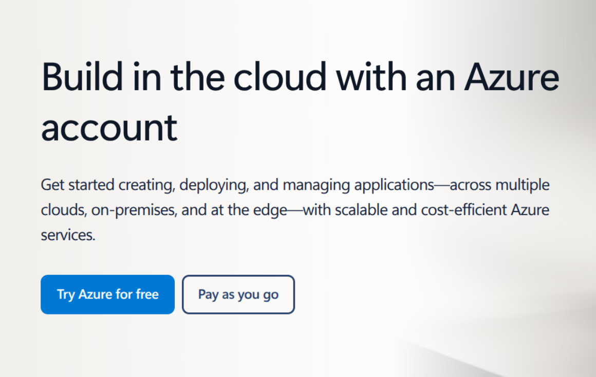

# Pre-requistes for Cloud-Computing hands-on on Azure

## Get a `github.com` account

Follow [this link](https://github.com/signup?ref_cta=Sign+up&ref_loc=header+logged+out&ref_page=%2F&source=header-home)  
And fill-in the form as shown below:  


## Get a free trial `azure` account
### Signup to `azure.com`
Follow [this link](https://azure.microsoft.com/en-us/pricing/purchase-options/azure-account?icid=free-services&ref=www.google.com&hasfullconsent=false)  
And click on `Try Azure for free`



This will provide you with a 200 USD credits to be consummed within 30 days.

### Setup a `budget` using the Azure portal

1. go to the [Azure portal](https://portal.azure.com)

   - navigate to `Cost Management + Billing`
   - select `Budgets`
   - create a budget, set it to 180$ and set some associated alerts (i.e. 50%, 80%, 95%) to be notified when these thresholds are met


## Install `WSL 2`
> :bulb: This step needs to be executed only if you are running a Windows laptop.  
> If you are running Linux, you can skip this step

Follow the instructions documented [here](https://learn.microsoft.com/en-us/windows/wsl/install)


## Install the `azure` CLI (`az`)

1. install the Azure CLI (`az`) using these instructions [here](https://learn.microsoft.com/en-us/cli/azure/install-azure-cli-linux?pivots=apt)
2. login to Azure with the CLI

   ```bash
   az login --use-device-code
   az account list      # get the list of all subscriptions in my account
   az account show      # show what is the subscription currently selected
   az account set --subscription "Azure subscription 1"     # select a subscription
   ```

## Invite me to your Azure account

### send invitation
- go to [`https://portal.azure.com`](https://portal.azure.com)
   - in the search box at the top, enter `Microsoft EntraID` and select the corresponding entry from the `Services` section
     - from the menu on the left, select `Manage > Users`
       - at the top of the panel, expand `New user` and select `Invite external user`
         - in the field `Email` enter `mdimonte@gmail.com`
         - click on `Review + invite`
         - click on `Invite`

### grant me access
- Grant me readonly access to your 'subscription'
   - in the search box at the top, enter `Subscriptions` and select the corresponding entry from the `Services` section
     - select the subscription `Azure subscription 1`
       - from the menu select `Access control (IAM)`
         - at the top of the panel, expand `Add` and select `Add role assignment`
           - from the list of roles dsiplayed select the entry `Reader`
           - click on `Next`
           - click on `+ Select members`
           - from the panel on the right select the user `mdimonte(Guest) mdimonte@gmail.com`
           - click on `Select`
           - click on `Review + assign`
           - click on `Review + assign` again
