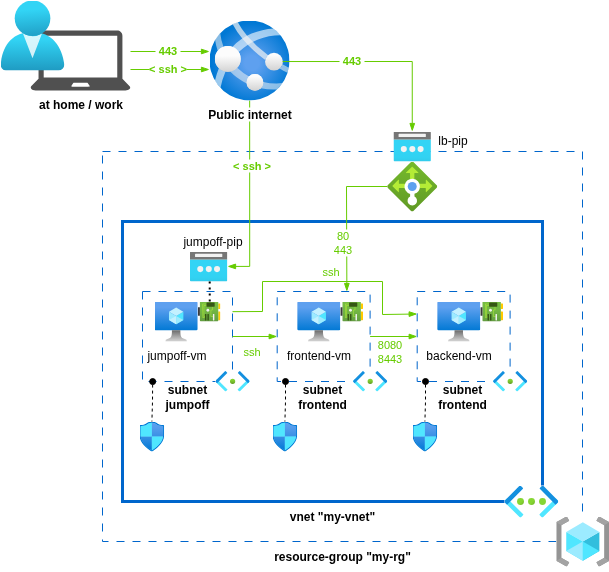

# Cloud-Computing hands-on on Azure -- the basics

## Hands-on 1

The objective of this 1st hands-on session is to provision a Virtual Machine and make sure you can connect to it securely.

Here are the main steps to perform:
- create a `virtual network` (a.k.a. `vnet`)
- create a `subnet` un that `vnet`
- create an SSH key pair.  
  Note: this can be achieve using the tool `ssh-keygen`
- create a `network security group` (a.k.a. `nsg`) that allows inbound SSH connections only from your own public IP
- bind the `nsg` to the `subnet` you have created earlier
- create a IPv4 `public IP address` (a.k.a. `pip`)
- create a `virtual machine` (a.k.a. `vm`) using these properties:
  - OS image: `ubuntu-24_04-lts`
  - make sure to enable SSH connections usign SSH key-pairs (not passwords)
  - VM size: `B1s`
  - use the `pip` you have created earlier as the public IP address of this VM
  - use a 'Standard HDD' OS disk
  - do not enable specific monitoring, backup
  - enable auto-shutdown (at 6.00pm for example)

## Hands-on 2

The objective is to restart from scratch and provision the solution depicted below:

> Note: only the network traffic depicted with green arrows should be allowed

Once this is done, verify that `ssh` traffic is implemented as expected:
- you can establish an `ssh` connection from your laptop to the `jumpoff` VM
- you cannot establish `ssh` connections from your laptop directly to the VMs hosted in the subnets `frontend` or `backend`
- you can establish an `ssh` connection from the `jumpoff` VM to the VMs hosted in the subnets `frontend` or `backend`

Finally, verify that application traffic is also implemented as expected:
- you can open network connections from your laptop to the LoadBalancer only on ports `80` and `443` (which should got the traffic to the VM `frontend-vm-1`)
- you can open network connections from the VM hosted in the subnet `frontend` to the VM hosted in the subnet `backend` only on ports `8080` and `8443`

## Hands-on 3

The objective is to connect to the VM `frontend-vm-1` to install and configure an `nginx` webserver:
- install `nginx` using `apt`
- generate a self-signed TLS certificate referencing the DNS name associated to the public IP address bound to the public load-balancer forwarding the traffic to the vm `fronend-vm`
  > note: use the tool `openssl` to generate the certificate
- update (or create) the `nginx` file `/etc/nginx/sites-available/default` so that:
    - `nginx` listens on port 80 for non-ssl traffic
    - `nginx` listens on port 443 for ssl traffic
    - `nginx` use the TLS certificate you have created above to secure the HTTP traffic on port 443
- cutomize the file `/var/www/html/index.html` as you like
- verify that you can access the web-server from your laptop

# Hands-on 4

The objective is to delete the VM `frontend-vm-1` and to recreate it using the CLI `az` as much as possible instead of using the Azure Portal:
- create the VM using `az`
  > note: manage the installation of nginx as well as its configuration using a [cloud-init](https://cloud-init.io/) script.  
  > you will need to document:
  > - a section `packages` to install `apt` packages
  > - a section `write_files` to create files
  > - a section `runcmd` to execute specific shell commands (i.e. to generate the certificate)
- add the new VM in the backend pool of the LoadBalancer using the Azure Portal
- verify that you can access the web-server from your laptop
